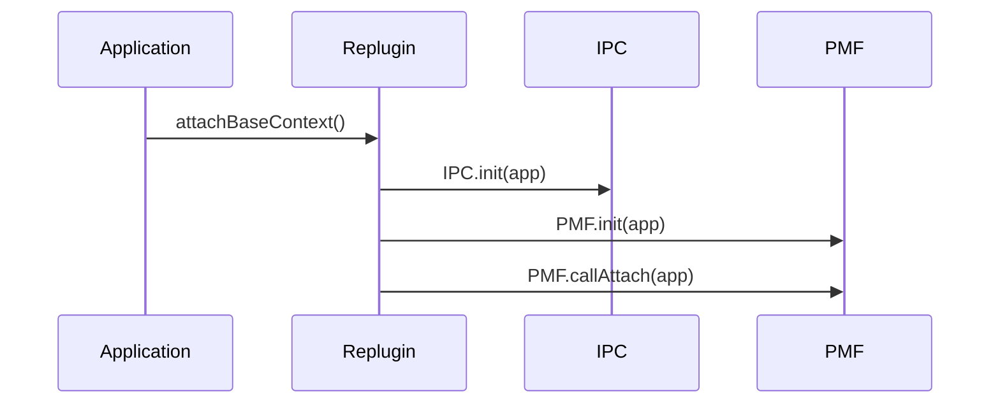
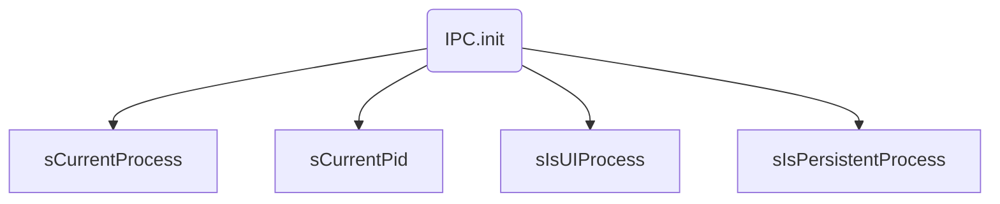
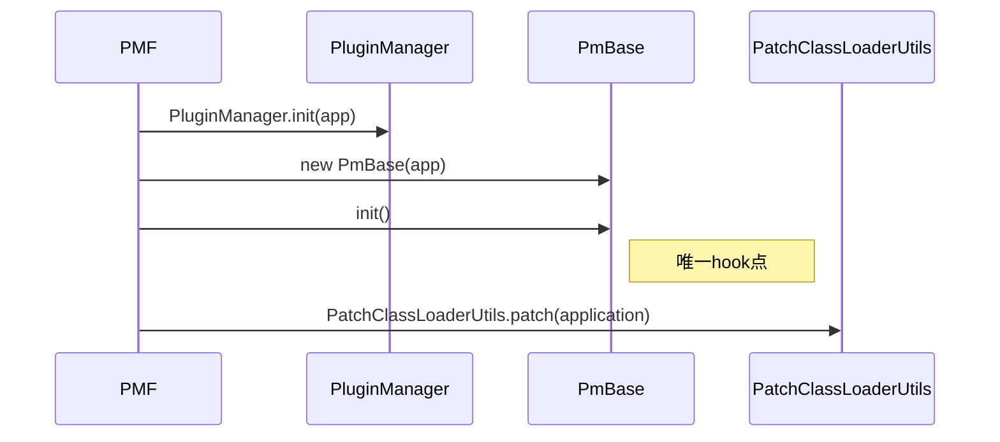
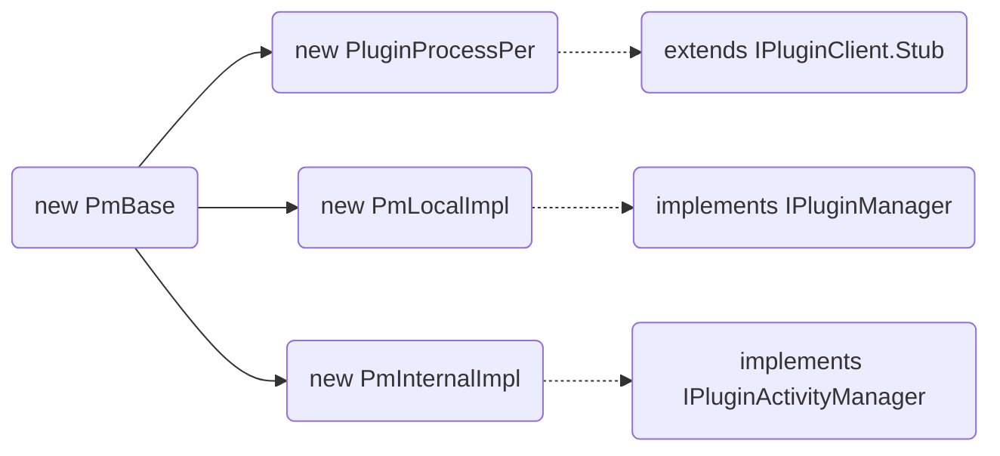
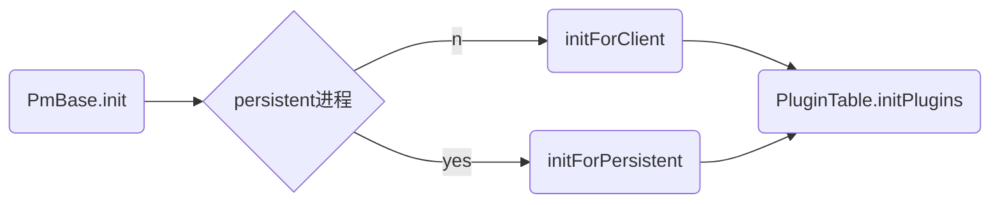
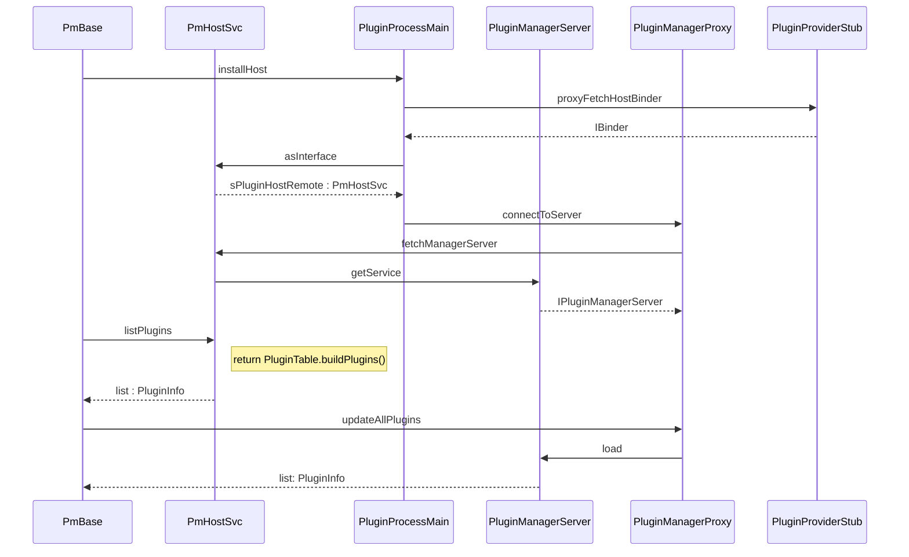
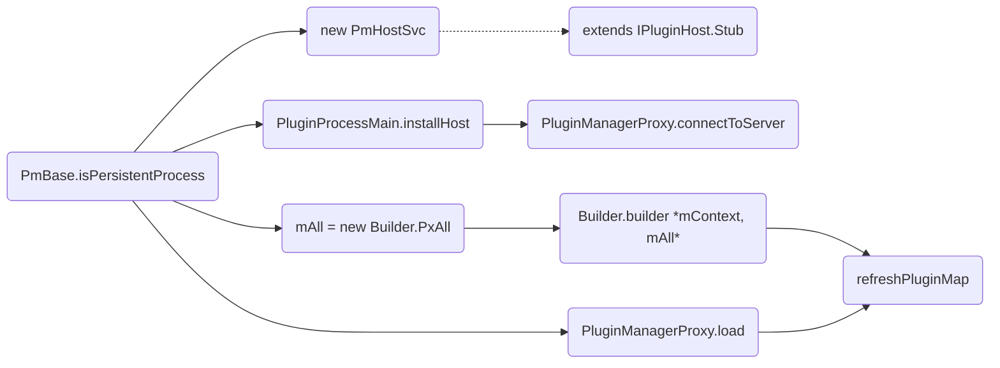
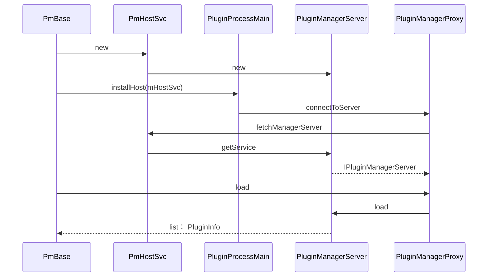

# Replugin分析(1)
[TOC]

在使用Replugin的应用的Application创建时会回调attachBaseContext方法，在这里调用Replugin相应的方法进行框架的初始化工作。


> Replugin: attachBaseContext()

这里需要理解下面这些方法做了什么：

* IPC.init ?
* PMF.init ?
* PMF.callAttach ?

## IPC.init
初始化进程信息，判断当前进程是UI进程还是Persistent进程。


> replugin有两个进程：UI进程和常驻进程。通过进程名判断是在哪个进程。

```bash
D lya     : ==========IPC.init()
D lya     : sCurrentProcesscom.qihoo360.replugin.sample.host
D lya     : sCurrentPid5422
D lya     : sPackageNamecom.qihoo360.replugin.sample.host
D lya     : ==========IPC.init()
D lya     : sCurrentProcesscom.qihoo360.replugin.sample.host:GuardService
D lya     : sCurrentPid5439
D lya     : sPackageNamecom.qihoo360.replugin.sample.host
```
## PMF
PMF是插件管理对外开放的接口。


### PMF.init
这个函数会做两件事情，初始化PmBase以及Hook系统的PathClassLoader。

```java
public static final void init(Application application) {
    setApplicationContext(application);
    PluginManager.init(application);

    sPluginMgr = new PmBase(application);
    sPluginMgr.init();  
    ......
    PatchClassLoaderUtils.patch(application);   
    //Hook系统Loader，这里是系统唯一Hook点
}
```


> PMF.init()

### PMF.callAttach
直接调用PmBase相应的方法。

```java
public static final void callAttach() {
    sPluginMgr.callAttach();
}
```
需要理解一下实现：

* sPluginMgr = new PmBase(application) ？
* sPluginMgr.init() ？
* PatchClassLoaderUtils.patch(application) ？
* sPluginMgr.callAttach()

## PmBase
PmBase的创建和初始化，其实这也是Replugin框架核心初始化的开始， PmBase它本身和它内部引用的其他对象掌握了Replugin中很多重要的功能,例如：分配坑位、初始化插件信息、Clent端连接Server端、加载插件、更新插件、删除插件、等等。
### PmBase的创建

后面讲解：

* PluginProcessPer类作用？
* PmLocalImpl作用？
* PmInternalImpl作用？

### PmBase.init
Replugin中对插件的管理是运行在独立的进程中的，所以会调用两次Applicaion的创建过程，同样也会调用两个init方法，所以这里会根据不同进程存在两个分支。

```java
    void init() {
        if (IPC.isPersistentProcess()) {
            mHostSvc = new PmHostSvc(mContext, this);
            PluginProcessMain.installHost(mHostSvc);
            PluginProcessMain.schedulePluginProcessLoop(PluginProcessMain.CHECK_STAGE1_DELAY);
            initForPersistent();
        } else {
            PluginProcessMain.installHost();
            initForClient();
        }
        // 最新快照
        PluginTable.initPlugins(mPlugins);
    }
```



#### 在UI进程分支中

>PmBase.initForClient

* PmHostSvc是两个进程间通信的Binder对象，在UI进程中通过上面的初始化过程持有其代理对象，并通过该对象与常驻进程通信。
* PmHostSvc中有个PluginManagerServer对象，用来进行插件管理的，通过上面过程，各进程可以统一使用PluginManagerProxy调用相应方法。

#### 在常驻进程分支中




> PmBase.initForPersistent


