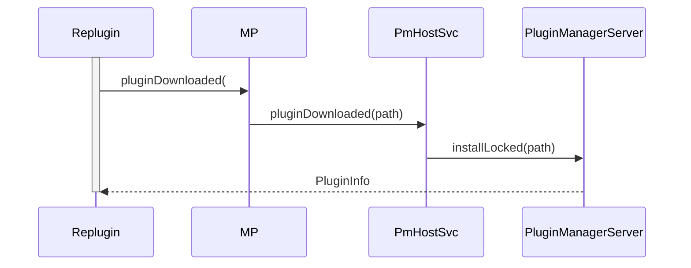

# Replugin分析（3）
[TOC]
## 外置插件的安装


```java
// com.qihoo360.replugin.RePlugin

public static PluginInfo install(String path) {
    if (TextUtils.isEmpty(path)) {
        throw new IllegalArgumentException();
    }
    // 判断文件合法性
    。。。
    //安装插件
    return MP.pluginDownloaded(path);
}
```
这里只将APK移动（或复制）到“插件路径”下，不释放优化后的Dex和Native库，不会加载插件。

```java
// com.qihoo360.loader2.MP
public static final PluginInfo pluginDownloaded(String path) {
    ...
    //获取IPluginHost类型对象并调用它的pluginDownloaded方法
    PluginInfo info = PluginProcessMain.getPluginHost().pluginDownloaded(path);
    ...
}
```

```java
// com.qihoo360.loader2.PmHostSvc
 public PluginInfo pluginDownloaded(String path) throws RemoteException {
    PluginInfo pi;
    ...
    //执行插件安装
    pi = mManager.getService().install(path);
    //后面会再回来分析这里
    if (pi != null) {
        // 通常到这里，表示“安装已成功”，这时不管处于什么状态，都应该通知外界更新插件内存表
        syncPluginInfo2All(pi);
    }
 }
```
```java
// com.qihoo360.replugin.packages.PluginManagerServer
private PluginInfo installLocked(String path) {
    //是否开启签名验证
    final boolean verifySignEnable = RePlugin.getConfig().getVerifySign();      
    final int flags = verifySignEnable ? PackageManager.GET_META_DATA | PackageManager.GET_SIGNATURES : PackageManager.GET_META_DATA;

    // 1. 读取APK内容
    PackageInfo pi = mContext.getPackageManager().getPackageArchiveInfo(path, flags);
    if (pi == null) {
        if (LogDebug.LOG) {
            LogDebug.e(TAG, "installLocked: Not a valid apk. path=" + path);
        }

        RePlugin.getConfig().getEventCallbacks().onInstallPluginFailed(path, RePluginEventCallbacks.InstallResult.READ_PKG_INFO_FAIL);
        return null;
    }

    // 2. 校验插件签名
    if (verifySignEnable) {
        if (!verifySignature(pi, path)) {
            return null;
        }
    }

    // 3. 通过PackageInfo解析插件apk中的包名、AndroidManifest.xml中的metaData标签、根据这些信息new一个PluginInfo
    PluginInfo instPli = PluginInfo.parseFromPackageInfo(pi, path);      

    //标记未安装
    instPli.setType(PluginInfo.TYPE_NOT_INSTALL);

    //获取之前是否已经安装过这个插件,false代表是返回原对象，true返回clone后的对象
    PluginInfo curPli = MP.getPlugin(instPli.getName(), false);

    if (curPli != null) {
        // 若要安装的插件版本小于或等于当前版本，则安装失败
        // 检查版本,版本较老？直接返回
        final int checkResult = checkVersion(instPli, curPli);
        if (checkResult < 0) {
            RePlugin.getConfig().getEventCallbacks().onInstallPluginFailed(path, RePluginEventCallbacks.InstallResult.VERIFY_VER_FAIL);
            return null;
        } else if (checkResult == 0){
            //设置同版本覆盖
            instPli.setIsPendingCover(true);
        }
    }

    // 4. 将合法的APK改名后，移动到指定位置
    if (!copyOrMoveApk(path, instPli)) {
        RePlugin.getConfig().getEventCallbacks().onInstallPluginFailed(path, RePluginEventCallbacks.InstallResult.COPY_APK_FAIL);
        return null;
    }

    // 5. 从插件中释放 So 文件，注意不是加载，只是将需要是so放到指定文件下
    PluginNativeLibsHelper.install(instPli.getPath(), instPli.getNativeLibsDir());

    // 6. 若已经安装旧版本插件，则尝试更新插件信息，否则直接加入到列表中
    if (curPli != null) {
        //如果已经安装过该插件，会设置待更新信息、和指定上一个版本对象
        updateOrLater(curPli, instPli);
    } else {
        mList.add(instPli);
    }

    // 7. 保存插件信息到文件中，下次可直接使用
    mList.save(mContext);

    return instPli;
}
```
## 插件的加载
插件安装的时候最后封装成的Plugin对象，插件的加载就不分内置插件和外置插件了，都是调用Plugin.load来完成的

```java
// com.qihoo360.loader2.Plugin
final boolean load(int load, boolean useCache) {
    //插件信息对象
    PluginInfo info = mInfo;
    //解析加载apk
    boolean rc = loadLocked(load, useCache);
    // 尝试在此处调用Application.onCreate方法
    if (load == LOAD_APP && rc) {
        //创建插件Application
        callApp();
    }
    ...
    return rc;
}

private boolean loadLocked(int load, boolean useCache) {
    ...
    //加载插件apk
    boolean rc = doLoad(logTag, context, parent, manager, load);
    ...
}

private final boolean doLoad(String tag, Context context, ClassLoader parent, PluginCommImpl manager, int load) {
    //创建插件加载类
    mLoader = new Loader(context, mInfo.getName(), mInfo.getPath(), this);
    //加载插件数据
    if (!mLoader.loadDex(parent, load)) {
        return false;
    }
    
    // 初始化插件工程框架
    if (load == LOAD_APP) {
        // NOTE Entry对象是可以在任何线程中被调用到
        if (!loadEntryLocked(manager)) {
            return false;
        }
    }
}
```

