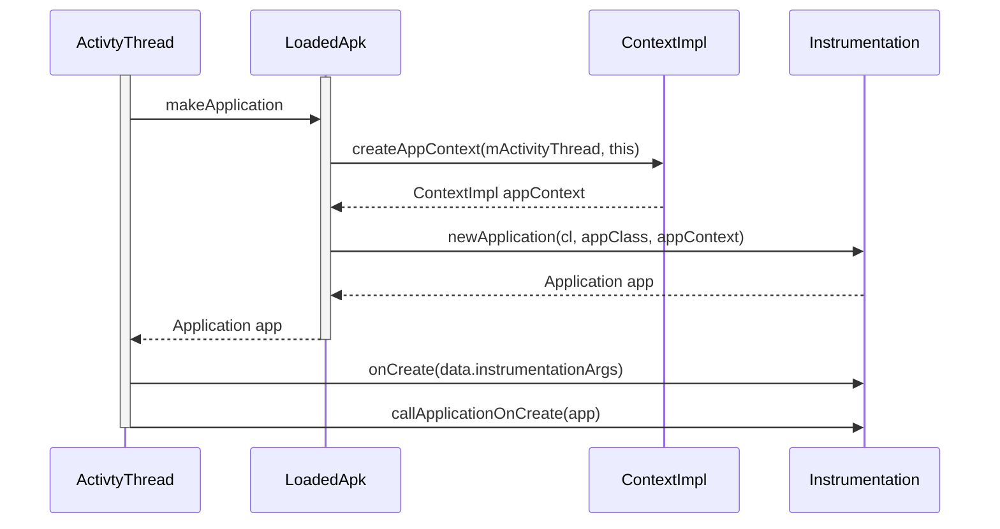

# 理解Context
## context是什么
Context是一个抽象类，我们通过这个Context可以访问包内的资源(res和assets)和启动其他组件(activity、service、broadcast)以及系统服务(systemService)等。所以Context提供了一个应用程序运行环境，在Context的环境里，应用才可以访问资源，才能和其他组件、服务交互，Context定义了一套基本功能接口，我们可以理解为一套规范，而Activity和Service是实现这套规范的具体实现类(其实内部是ContextImpl统一实现的)。所以可以这样说，Context是维持Android程序中各个组件能够正常工作的一个核心功能类。

## context都有哪些子类

因此在绝对大多数场景下，Activity、Service和Application这三种类型的Context都是可以通用的，因为他们都是ContextWrapper的子类，但是由于如果是启动Activity，弹出Dialog，一般涉及到"界面"的领域，都只能由Activity来启动。因为出于安全的考虑，Android是不允许Activity或者Dialog凭空出现的，一个Activity的启动必须建立在另一个Activity的基础之上，也就是以此形成了返回栈。而Dialog则必须在一个Activity上面弹出(如果是系统的除外)，因此这种情况下我们只能使用Activity类型的Context。整理了一些使用场景的规则，也就是Context的作用域，如下图：


### ContextImpl和ContextWrapper关系
```java
public class ContextWrapper extends Context {
    Context mBase;

    public ContextWrapper(Context base) {
        mBase = base;
    }
    
    /**
     * Set the base context for this ContextWrapper.  All calls will then be
     * delegated to the base context.  Throws
     * IllegalStateException if a base context has already been set.
     * 
     * @param base The new base context for this wrapper.
     */
    protected void attachBaseContext(Context base) {
        if (mBase != null) {
            throw new IllegalStateException("Base context already set");
        }
        mBase = base;
    }
```
通过这个方法来设置ContextWrapper的字段mBase赋值，所有的调用其实是代理调用到mBase这个Context，如果字段mBase已经被赋值了，则会抛出异常。

### ContextImpl
* ContextImpl类是ReceiverRestrictedContext的内部类
* ContextImpl的构造函数是private，所以外部想要获取ContextImpl的实例，所以通过它的其他方法
* createSystemContext(//省略入参)方法可以获取系统的ContextImpl
* createAppContext(//省略入参)方法获取获取Application的ContextImpl
* createActivityContext(省略入参)方法获取Activity的ContextImpl

## Application及对应的mBase实例创建过程
应用程序中包含多个ContextImpl对象，而内部变量mPackageInfo却指向了同一个LoadedApk对象，这种设计结构意味着ContextImpl中大多数进行包操作的重量级函数实际上都转向了mPackageInfo对象的响应方法，也就是事实上调用了同一个LoadedApk对象。


> private void handleBindApplication(AppBindData data)

* 里面调用ContextImpl.createAppContext(ActivityThread, LoadedApk)方法获取一个 ContextImpl 对象
* 调用 Instrumentation的newApplication(ClassLoader ,String, Context) 方法创建一个 **Application** 。
* appContext.setOuterContext(app) 
* 在newApplication中attach（）中设置 Application的ContextImpl

```java
//ActivityThread.java
    private void handleBindApplication(AppBindData data) {
          //省略部分代码
        
        try {
            // If the app is being launched for full backup or restore, bring it up in
            // a restricted environment with the base application class.
            Application app = data.info.makeApplication(data.restrictedBackupMode, null);
            mInitialApplication = app;

            if (!data.restrictedBackupMode) {
                if (!ArrayUtils.isEmpty(data.providers)) {
                    installContentProviders(app, data.providers);
                    // For process that contains content providers, we want to
                    // ensure that the JIT is enabled "at some point".
                    mH.sendEmptyMessageDelayed(H.ENABLE_JIT, 10*1000);
                }
            }
            try {
                mInstrumentation.onCreate(data.instrumentationArgs);
            }
            catch (Exception e) {
                throw new RuntimeException(
                    "Exception thrown in onCreate() of "
                    + data.instrumentationName + ": " + e.toString(), e);
            }

            try {
                mInstrumentation.callApplicationOnCreate(app);
            } catch (Exception e) {
                if (!mInstrumentation.onException(app, e)) {
                    throw new RuntimeException(
                        "Unable to create application " + app.getClass().getName()
                        + ": " + e.toString(), e);
                }
            }
        } finally {
            StrictMode.setThreadPolicy(savedPolicy);
        }
    }
```
```java
public Application makeApplication(boolean forceDefaultAppClass,
            Instrumentation instrumentation) {
        if (mApplication != null) {
            return mApplication;
        }
        Trace.traceBegin(Trace.TRACE_TAG_ACTIVITY_MANAGER, "makeApplication");
        Application app = null;
        String appClass = mApplicationInfo.className;
        if (forceDefaultAppClass || (appClass == null)) {
            appClass = "android.app.Application";
        }
        try {
            java.lang.ClassLoader cl = getClassLoader();
            if (!mPackageName.equals("android")) {
                Trace.traceBegin(Trace.TRACE_TAG_ACTIVITY_MANAGER,
                        "initializeJavaContextClassLoader");
                initializeJavaContextClassLoader();
                Trace.traceEnd(Trace.TRACE_TAG_ACTIVITY_MANAGER);
            }

************************重点******************************
            ContextImpl appContext = ContextImpl.createAppContext(mActivityThread, this);
            app = mActivityThread.mInstrumentation.newApplication(
                    cl, appClass, appContext);
            appContext.setOuterContext(app);
************************重点******************************
        } catch (Exception e) {
            if (!mActivityThread.mInstrumentation.onException(app, e)) {
                Trace.traceEnd(Trace.TRACE_TAG_ACTIVITY_MANAGER);
                throw new RuntimeException(
                    "Unable to instantiate application " + appClass
                    + ": " + e.toString(), e);
            }
        }
        mActivityThread.mAllApplications.add(app);
        mApplication = app;
       //省略部分代码
    }
```
```java
public Application newApplication(ClassLoader cl, String className, Context context)
            throws InstantiationException, IllegalAccessException, 
            ClassNotFoundException {
        return newApplication(cl.loadClass(className), context);
    }

    static public Application newApplication(Class<?> clazz, Context context)
            throws InstantiationException, IllegalAccessException, 
            ClassNotFoundException {
        Application app = (Application)clazz.newInstance();
        app.attach(context);
        return app;
    }
```
## Activity及对应的mBase实例创建过程
## APP各种Context访问资源的唯一性详解

## 参考资料
[http://www.jianshu.com/p/e6ce2d03f8f9](http://www.jianshu.com/p/e6ce2d03f8f9)


