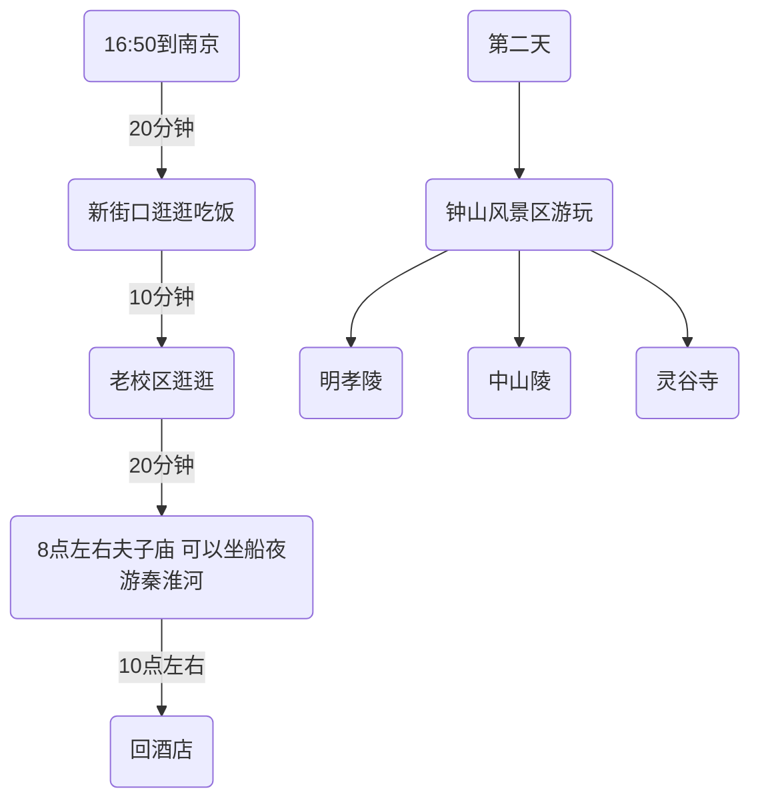

# 南京周末一日游
## 方案一：南京市区游

### 酒店
* 南京总统府亚朵酒店
* 大行宫总统府附近

### 神道/明孝陵
> 南京秋天最美的650米
> 这个季节来明孝陵，去神道赏南金最美秋景是必不可少的，神道主要路段分“石像路”与“翁仲路”两段，而“石像路”被南京市民称为“南京秋天最美的650米”大道，橙黄的乌桕、紫红的榉树，灿黄的银杏，呈现出了一幅美丽的金秋画卷，缤纷落叶和曲折深幽的石像路相映成景，吸引大量游客和摄影爱好者前来观赏。

明孝陵，中山陵：乘坐2号线苜蓿园站下车
灵谷寺：2号线钟林街下车

## 方案二：汤山温泉游

|   | 时间 | 价格 | 换乘 |
| --- | --- | --- | --- |
| 打车 | 40min | 95元 | 无 |
| 公交 | 2h | 忽略 | 3号线-2号线-D11-845 |
| 旅游巴士 | 整点出发 | 10元 | 直达 |

