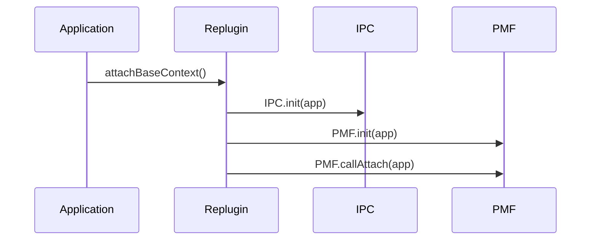
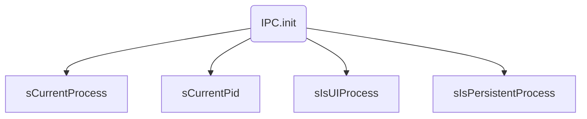
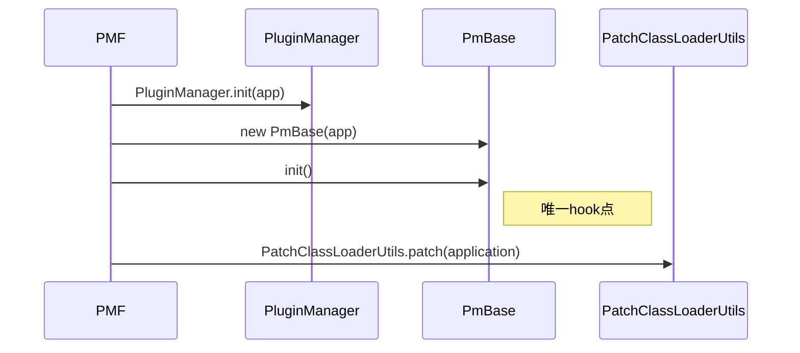
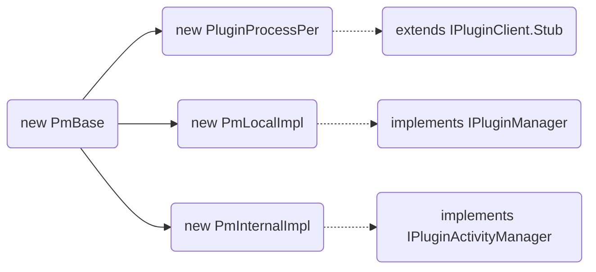
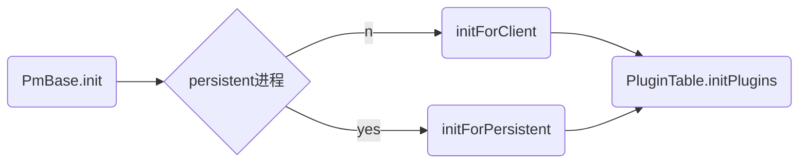
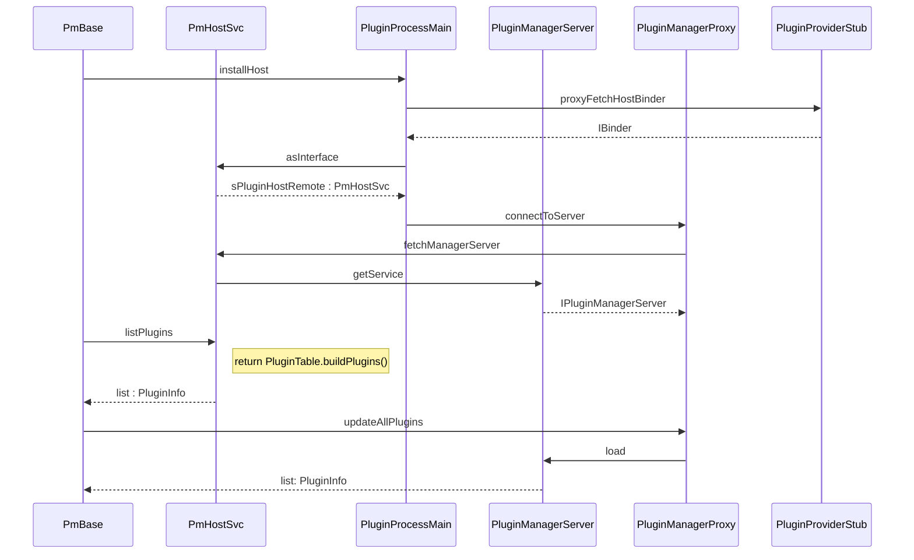
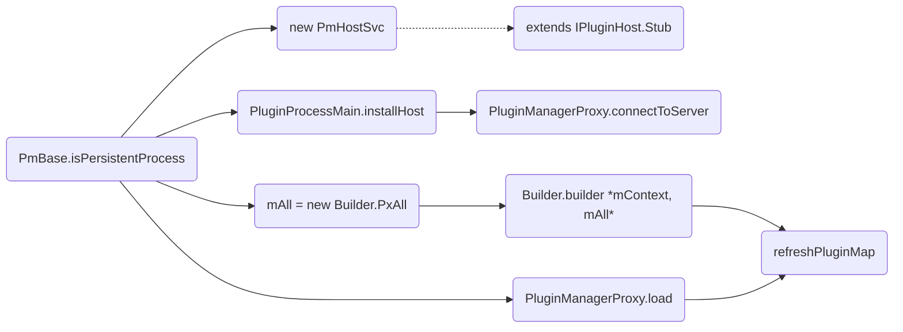
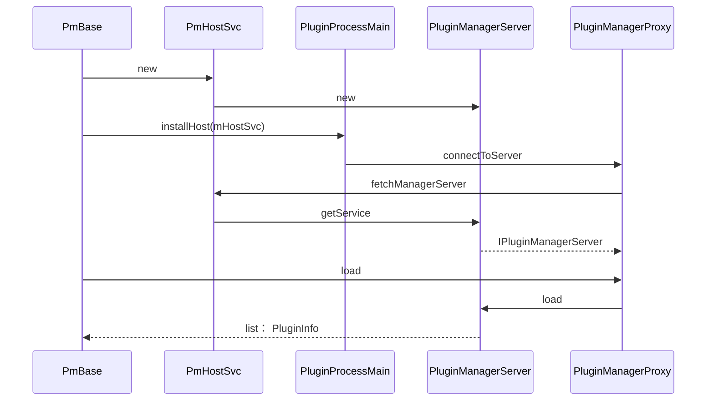
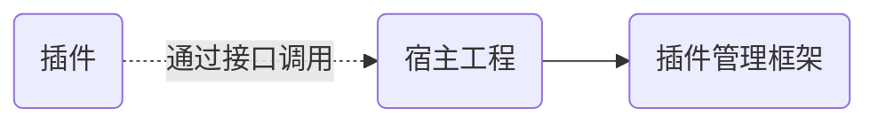
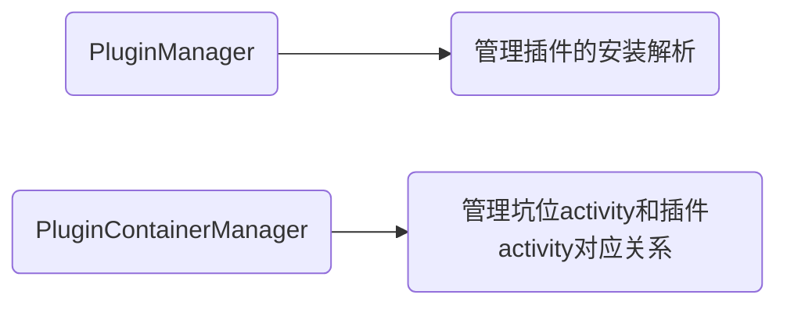

# Replugin分析总结
[TOC]

Replugin框架还是使用占坑的方式实现的插件化，打开插件Activity时会启动坑位Activity以欺骗系统达到不在AndroidManifest.xml注册的效果。
不过它没有hook系统的Instrumentation.newActivity行为启动插件中的Activity，而是Hook了宿主的Classloader，增加了当load的class是坑位Activity时会去查找该坑位对应的Activity的逻辑，实现创建插件Activity的目的。

```java
// ActivityThread
private Activity performLaunchActivity(ActivityClientRecord r, Intent customIntent) {
    ...
        java.lang.ClassLoader cl = r.packageInfo.getClassLoader();
//创建Activity
    activity = mInstrumentation.newActivity(
            cl, component.getClassName(), r.intent);
    ...
```
Replugin唯一的hook点其实就是上面这个cl（Classloader）。

Replugin的整体框架使用了Binder机制来进行宿主和多插件之间交互通信和数据共享。默认会使用一个常驻的进程作为Server端，插件之间和宿主之间沟通和数据共享，插件的安装，卸载，更新，状态判断等全部都在这个Server端完成。其他插件进程和宿主进程都属于Clent端。这也是它整个代码框架比较复杂的原因。当然整体框架由于版本迭代导致的代码结构混乱也是导致其比较复杂的原因。

Replugin的插件管理机制也是比较复杂，设计到版本管理，坑位管理，多进程通信和同步。不过它解析apk流程以及构造插件Resouce，加载插件资源和使用xml创建插件中的view这些细节的处理都很值得借鉴，同样也坚持了没有hook。
下面我们先看看Replugin的框架的初始化即使用了Binder机制来进行宿主和多插件之间交互通信和数据。

## Replugin的框架的初始化
在使用Replugin的应用的Application创建时会回调attachBaseContext方法，在这里调用Replugin相应的方法进行框架的初始化工作。


> Replugin: attachBaseContext()

### IPC.init
初始化进程信息，判断当前进程是UI进程还是Persistent进程。主要就是通过proc文件获取当前进程名、进程id和宿主包名,然后设置常驻进程的名称，最后标记当前进程是否是ui进程和是不是常驻进程，我们知道每一个进程在创建后都会调用该进程的ActivitiThread的main方法，开启消息循环，绑定AMS，创建Application，加载provider，然后回调Application生命周期方法。所以说这里会被调用多次，多次调用导致了IPC中判断当前是否是插件管理进程时的值不同而影响后面的执行逻辑不同。 


> replugin有两个进程：UI进程和常驻进程。通过进程名判断是在哪个进程。

```bash
D lya     : ==========IPC.init()
D lya     : sCurrentProcesscom.qihoo360.replugin.sample.host
D lya     : sCurrentPid5422
D lya     : sPackageNamecom.qihoo360.replugin.sample.host
D lya     : ==========IPC.init()
D lya     : sCurrentProcesscom.qihoo360.replugin.sample.host:GuardService
D lya     : sCurrentPid5439
D lya     : sPackageNamecom.qihoo360.replugin.sample.host
```

### PMF
PMF是插件管理对外开放的接口。PMF的初始化时创建初始了Replugin需要核心类和hook系统的ClassLoader都在这里。


#### PMF.init
这个函数会做两件事情，初始化PmBase以及Hook系统的PathClassLoader。

```java
public static final void init(Application application) {
    setApplicationContext(application);
    PluginManager.init(application);

    sPluginMgr = new PmBase(application);
    sPluginMgr.init();  
    ......
    PatchClassLoaderUtils.patch(application);   
    //Hook系统Loader，这里是系统唯一Hook点
}
```


> PMF.init()

#### PMF.callAttach
直接调用PmBase相应的方法。

```java
public static final void callAttach() {
    sPluginMgr.callAttach();
}
```

### PmBase
PmBase的创建和初始化，其实这也是Replugin框架核心初始化的开始， PmBase它本身和它内部引用的其他对象掌握了Replugin中很多重要的功能,例如：分配坑位、初始化插件信息、Clent端连接Server端、加载插件、更新插件、删除插件、等等。
#### PmBase的创建

#### PmBase.init
Replugin中对插件的管理是运行在独立的进程中的，所以会调用两次Applicaion的创建过程，同样也会调用两个init方法，所以这里会根据不同进程存在两个分支。

```java
    void init() {
        if (IPC.isPersistentProcess()) {
            mHostSvc = new PmHostSvc(mContext, this);
            PluginProcessMain.installHost(mHostSvc);
            PluginProcessMain.schedulePluginProcessLoop(PluginProcessMain.CHECK_STAGE1_DELAY);
            initForPersistent();
        } else {
            PluginProcessMain.installHost();
            initForClient();
        }
        // 最新快照
        PluginTable.initPlugins(mPlugins);
    }
```



##### 在UI进程分支中

>PmBase.initForClient

* PmHostSvc是两个进程间通信的Binder对象，在UI进程中通过上面的初始化过程持有其代理对象，并通过该对象与常驻进程通信。
* PmHostSvc中有个PluginManagerServer对象，用来进行插件管理的，通过上面过程，各进程可以统一使用PluginManagerProxy调用相应方法。

##### 在常驻进程分支中




> PmBase.initForPersistent

总结一下：
>1、首先创建了一个PmHostSvc对象，这个类继承IPluginHost.Stub，是一个IPluginHost类型的Binder对象，可以说所有的插件的管理工作都是直接或者间接由它处理的，PmHostSvc它代表了Server端要处理的事情，也就是插件管理进程处理的事情

>2、在PmHostSvc的构造方法中又创建了两个对象，一个是PluginServiceServer，这个类是用来管理插件Service的远程Server端，还有一个是PluginManagerServer，这个类在创建的时候在构造中又创建了一个继承自IPluginServiceServer.Stub的Stub对象，Stub也是一个Binder对象，通过后来查看IPluginServiceServer的代码，发现这个类掌管了所有对插件的的操作，例如插件的安装、加载、卸载、更新等等

>3、调用PluginProcessMain.installHost(mHostSvc)方法将PmHostSvc对象也就是IPluginHost类型赋值给PluginProcessMain中的字段sPluginHostLocal，这个IPluginHost是Binder对象。接着调用了IPluginHost.fetchManagerServer()方法将PluginManagerServer中的Stub对象，也就是IPluginServiceServer类型的Binder对象赋值给PluginManagerProxy类中的字段sRemote，这个IPluginServiceServer类型的Binder对象掌握了对插件的安装、卸载、更新等等的操作

如果对这方面感兴趣可以看源码或者[唯一插件化Replugin源码及原理深度剖析--初始化之框架核心](http://blog.csdn.net/yulong0809/article/details/78423529)的分析，不过我个人觉得Replugin这里写的过度封装，比如IPluginManagerServer是管理插件的安装加载等，只会在Service端运行，Replugin还是将它用AIDL设计。导致这部分代码结构比较混乱。

## Replugin的hook原理分析
上面我们也提到，在Application的attachBaseContext中我们hook了系统的Classloader。

```java
// PMF.init(application)
// PatchClassLoaderUtils.patch(application);
public static boolean patch(Application application) {
    Context oBase = application.getBaseContext();
    Object oPackageInfo = FieldUtils.readField(oBase, "mPackageInfo", true);
    ClassLoader oClassLoader = (ClassLoader) FieldUtils.readField(oPackageInfo, "mClassLoader", true);
    ClassLoader cl = new RePluginClassLoader(parent, original);
    FieldUtils.writeField(oPackageInfo, "mClassLoader", cl, true);
    Thread.currentThread().setContextClassLoader(cl);
}
```
这个RepluginClassLoader只是在加载class时做了一些特别处理，其他都是调用原来的Classloader中的相应方法。

```java
    @Override
    protected Class<?> loadClass(String className, boolean resolve) 
    throws ClassNotFoundException {
        Class<?> c = null;
        c = PMF.loadClass(className, resolve);
        if (c != null) {
            return c;
        }
        try {
            c = mOrig.loadClass(className);
            return c;
        } catch (Throwable e) {
            //
        }
        return super.loadClass(className, resolve);
    }
```
当宿主加载类时会被Replugin框架拦截，进过层层调用会到PmBase,如果这个class是坑位activity的话，会被找到这个坑位activity对应的Activity，然后加载这个Activity。


```java
    /**
     * 类加载器根据容器解析到目标的activity
     * @param container
     * @return
     */
final Class<?> resolveActivityClass(String container) {
    PluginContainers.ActivityState state = mACM.lookupByContainer(container);
    plugin = state.plugin;
    activity = state.activity;    
    Plugin p = mPluginMgr.loadAppPlugin(plugin);
    ClassLoader cl = p.getClassLoader();
    Class<?> c = null;
    c = cl.loadClass(activity);
```
关于它是如何hook系统Classloader和为什么这样可以保证能完全hook住系统Classloader，可以参见源码以及[唯一插件化Replugin源码及原理深度剖析--唯一Hook点原理](http://blog.csdn.net/yulong0809/article/details/78426280)这篇分析文章。

## 插件安装和加载
Replugin插件的安装加载逻辑设计到版本迭代，以及他们几套并存的插件管理机制（包括内置插件，p-n插件，外置插件。。）和多进程机制特别复杂，为了学习和借鉴它的原理和实现，我自己新建了工程，主要遵从hook系统Classloader，使用占坑插件化方案，使用单进程加载管理插件。源码地址：[https://github.com/liyonganStudy/plugin-master](https://github.com/liyonganStudy/plugin-master)


### 首先是在宿主工程中hook系统Classloader


其中PluginEngine就是插件管理框架对外暴露的接口，所有插件相关的操作都会调用它。**PatchClassLoaderUtils.pach(base)**就是hook系统Classloader，原理参照Replugin。
同时创建了PluginManager和PluginContainerManager对象。


### 加载插件基本信息

这里我把插件apk放在宿主工程的assets目录下再复制到宿主工程目录下模仿下载插件的过程。
接着调用**PluginEngine.getInstance().install(pluginFilePath)**安装插件。


这里其实只是解析了插件里的meta信息构造出插件基本信息。还没有完整解析插件已经构造插件的资源，context和Classloader。

### 解析插件和构造插件资源
直到真正打开插件Activity时才会解析和构造插件资源。

启动Activity首先会先解析插件获取目标Activity相关信息已经构造插件相关资源，然后通过坑位管理器将目标Activity替换为坑位Activity并保存该对应关系。接下来先看解析插件apk：


解析Apk的工作解耦给单独的Loader处理，我们接着看Loader.loadDex解析apk。

#### 1.解析apk信息

上面在分析VirtualApk是如何解析apk信息时已经提过。ComponetList存放的是插件Activity相关信息。

#### 2.创建插件资源

不同于一般通过addPath反射构造Resouce，这里通过pm.getResourcesForApplication避免反射hook系统隐藏api。它的实现原理在上面已经分析过。
### 3.创建Classloader

注意这里使用的是宿主Classloader的parent作为插件Classloader的parent。特别是想将宿主和插件隔离时，可以避免想加载插件的类却加载到宿主中的类的尴尬。音箱插件化也是在遇到一些坑后改成了这种生成插件Classloader的方案。
#### 4.创建插件的Context

这样在插件activity的attachBaseContext时attach插件自己的context，可以找到插件自己的资源，主题，Classloader等。

这里还有一个需要处理的就是创建xml中的View时使用LayoutInflater


这里我们需要复写修改在创建view时使用插件的ClassLoader和资源。


### 启动坑位Activity但创建插件Activity

接下来会通过坑位管理器找到合适的坑位Activity,并保存下坑位Activity和实际要启动的Activity之间的对应关系。
之后在ActivityThread创建Activity时，由于我们hook了宿主的Classloader，所以下面的cl其实就是我们hook的Classloader。


我们hook的Classloader在加载任何类时都会被PluginEngine.getInstance().loadClass拦截。特别是如果是坑位Activity时我们会用插件立面的Classloader加载，这样就完成了启动坑位Activity,骗过AMS的校验，创建的确实插件Activity的效果。


### 一起其他功能支持
#### 加载插件中Fragment
歌词模板以前是加载Fragment实现的，不过对xml的支持不行，不能再xml中使用资源是硬伤，使用上面的LayoutInflate方案可以加载Fragment并在xml中使用资源。


inflater使用插件的Context就可以加载xml中的资源和插件自定义控件等。
#### 插件和宿主通信


亲测使用接口可以进行通信。


