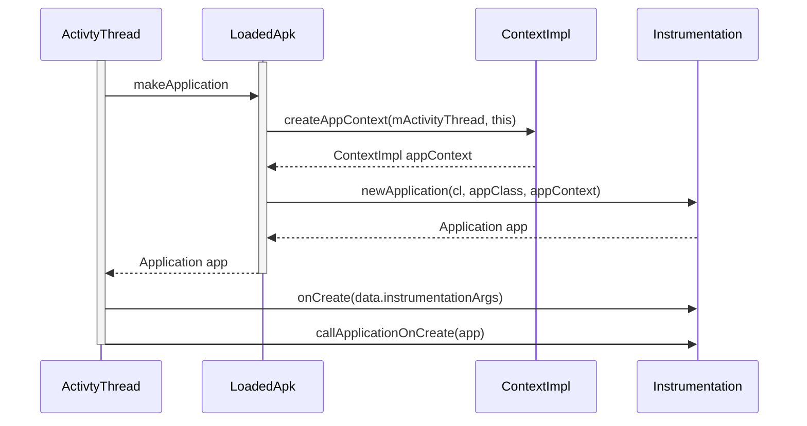

# 插件化背景知识
[TOC]

# 理解Context
## context是什么
Context是一个抽象类，我们通过这个Context可以访问包内的资源(res和assets)和启动其他组件(activity、service、broadcast)以及系统服务(systemService)等。所以Context提供了一个应用程序运行环境，在Context的环境里，应用才可以访问资源，才能和其他组件、服务交互，Context定义了一套基本功能接口，我们可以理解为一套规范，而Activity和Service是实现这套规范的具体实现类(其实内部是ContextImpl统一实现的)。所以可以这样说，Context是维持Android程序中各个组件能够正常工作的一个核心功能类。

## context都有哪些子类

因此在绝对大多数场景下，Activity、Service和Application这三种类型的Context都是可以通用的，因为他们都是ContextWrapper的子类，但是由于如果是启动Activity，弹出Dialog，一般涉及到"界面"的领域，都只能由Activity来启动。因为出于安全的考虑，Android是不允许Activity或者Dialog凭空出现的，一个Activity的启动必须建立在另一个Activity的基础之上，也就是以此形成了返回栈。而Dialog则必须在一个Activity上面弹出(如果是系统的除外)，因此这种情况下我们只能使用Activity类型的Context。整理了一些使用场景的规则，也就是Context的作用域，如下图：


### ContextImpl和ContextWrapper关系
```java
public class ContextWrapper extends Context {
    Context mBase;

    public ContextWrapper(Context base) {
        mBase = base;
    }
    
    /**
     * Set the base context for this ContextWrapper.  All calls will then be
     * delegated to the base context.  Throws
     * IllegalStateException if a base context has already been set.
     * 
     * @param base The new base context for this wrapper.
     */
    protected void attachBaseContext(Context base) {
        if (mBase != null) {
            throw new IllegalStateException("Base context already set");
        }
        mBase = base;
    }
```
通过这个方法来设置ContextWrapper的字段mBase赋值，所有的调用其实是代理调用到mBase这个Context，如果字段mBase已经被赋值了，则会抛出异常。

### ContextImpl
* ContextImpl类是ReceiverRestrictedContext的内部类
* ContextImpl的构造函数是private，所以外部想要获取ContextImpl的实例，所以通过它的其他方法
* createSystemContext(//省略入参)方法可以获取系统的ContextImpl
* createAppContext(//省略入参)方法获取获取Application的ContextImpl
* createActivityContext(省略入参)方法获取Activity的ContextImpl

## Application及对应的mBase实例创建过程
应用程序中包含多个ContextImpl对象，而内部变量mPackageInfo却指向了同一个LoadedApk对象，这种设计结构意味着ContextImpl中大多数进行包操作的重量级函数实际上都转向了mPackageInfo对象的响应方法，也就是事实上调用了同一个LoadedApk对象。


> private void handleBindApplication(AppBindData data)

* 里面调用ContextImpl.createAppContext(ActivityThread, LoadedApk)方法获取一个 ContextImpl 对象
* 调用 Instrumentation的newApplication(ClassLoader ,String, Context) 方法创建一个 **Application** 。
* appContext.setOuterContext(app) 
* 在newApplication中attach（）中设置 Application的ContextImpl

```java
//ActivityThread.java
    private void handleBindApplication(AppBindData data) {
          //省略部分代码
        
        try {
            // If the app is being launched for full backup or restore, bring it up in
            // a restricted environment with the base application class.
            Application app = data.info.makeApplication(data.restrictedBackupMode, null);
            mInitialApplication = app;

            if (!data.restrictedBackupMode) {
                if (!ArrayUtils.isEmpty(data.providers)) {
                    installContentProviders(app, data.providers);
                    // For process that contains content providers, we want to
                    // ensure that the JIT is enabled "at some point".
                    mH.sendEmptyMessageDelayed(H.ENABLE_JIT, 10*1000);
                }
            }
            try {
                mInstrumentation.onCreate(data.instrumentationArgs);
            }
            catch (Exception e) {
                throw new RuntimeException(
                    "Exception thrown in onCreate() of "
                    + data.instrumentationName + ": " + e.toString(), e);
            }

            try {
                mInstrumentation.callApplicationOnCreate(app);
            } catch (Exception e) {
                if (!mInstrumentation.onException(app, e)) {
                    throw new RuntimeException(
                        "Unable to create application " + app.getClass().getName()
                        + ": " + e.toString(), e);
                }
            }
        } finally {
            StrictMode.setThreadPolicy(savedPolicy);
        }
    }
```
```java
public Application makeApplication(boolean forceDefaultAppClass,
            Instrumentation instrumentation) {
        if (mApplication != null) {
            return mApplication;
        }
        Trace.traceBegin(Trace.TRACE_TAG_ACTIVITY_MANAGER, "makeApplication");
        Application app = null;
        String appClass = mApplicationInfo.className;
        if (forceDefaultAppClass || (appClass == null)) {
            appClass = "android.app.Application";
        }
        try {
            java.lang.ClassLoader cl = getClassLoader();
            if (!mPackageName.equals("android")) {
                Trace.traceBegin(Trace.TRACE_TAG_ACTIVITY_MANAGER,
                        "initializeJavaContextClassLoader");
                initializeJavaContextClassLoader();
                Trace.traceEnd(Trace.TRACE_TAG_ACTIVITY_MANAGER);
            }

************************重点******************************
            ContextImpl appContext = ContextImpl.createAppContext(mActivityThread, this);
            app = mActivityThread.mInstrumentation.newApplication(
                    cl, appClass, appContext);
            appContext.setOuterContext(app);
************************重点******************************
        } catch (Exception e) {
            if (!mActivityThread.mInstrumentation.onException(app, e)) {
                Trace.traceEnd(Trace.TRACE_TAG_ACTIVITY_MANAGER);
                throw new RuntimeException(
                    "Unable to instantiate application " + appClass
                    + ": " + e.toString(), e);
            }
        }
        mActivityThread.mAllApplications.add(app);
        mApplication = app;
       //省略部分代码
    }
```
```java
public Application newApplication(ClassLoader cl, String className, Context context)
            throws InstantiationException, IllegalAccessException, 
            ClassNotFoundException {
        return newApplication(cl.loadClass(className), context);
    }

    static public Application newApplication(Class<?> clazz, Context context)
            throws InstantiationException, IllegalAccessException, 
            ClassNotFoundException {
        Application app = (Application)clazz.newInstance();
        app.attach(context);
        return app;
    }
```
## Activity及对应的mBase实例创建过程
## APP各种Context访问资源的唯一性详解

## 参考资料
[http://www.jianshu.com/p/e6ce2d03f8f9](http://www.jianshu.com/p/e6ce2d03f8f9)

# 理解classloader
## classloader是什么？
* ClassLoader是类加载器，它是用来形容将一个类的二进制流加载到虚拟机中的过程
* 一个类的唯一性要由它的类加载器和它本身来确定，也就是说一个Class文件如果使用不同的类加载器来加载，那么加载出来的类也是不相等的
* Java中为了保证一个类的唯一性使用了双亲委派模型，也就是说如果要加载一个类首先会委托给自己的父加载器去完成，父加载器会再向上委托，直到最顶层的类加载器，如果父加载器没有找个要加载的类，子类才会尝试自己去加载，这样就保证了加载的类都是一个类

## Android中的ClassLoader
### BootClassLoader
它是Android中最顶层的ClassLoader，创建一个ClassLoader需要传入一个parent，而android中所有的ClassLoader的最终parent都是BootClassLoader
它是ClassLoader的内部类,可以通过ClassLoader.getSystemClassLoader().getParent()得到
### PathClassLoader
继承自BaseDexClassLoader ，它是我们apk的默认加载器，它是用来加载系统类和主dex文件中的类的，但是系统类是由BootClassLoader加载的，如果apk中有多个dex文件，只会加载主dex
### DexClassLoader
继承自BaseDexClassLoader ，可以用来加载外置的dex文件或者apk等 

### 总结
Android中主要使用的ClassLoader有PathClassLoader和DexClassLoader，它们都继承自BaseDexClassLoader，BaseDexClassLoader中维护了一个DexPathList，PathClassLoader和DexClassLoader查找类的操作直接调用BaseClassLoader的findClass方法，而BaseClassLoader的findClass中又通过内部维护的DexPathList来查找，DexPathList中又维护这一个Element数组，这个数组中Element元素其实就是Dex文件。

PathClassLoader和DexClassLoader最大的区别就是DexClassLoader可以加载外置dex文件，这是因为PathClassLoader构造方法中像上传递时第二个参数传了null，这个参数代表的是dex优化后的路径，DexPathList在生成Element数组时会判断这个参数是否为null，如果为null就使用系统默认路径/data/dalvik-cache，这也是导致如果要加载外置dex文件只能使用DexClassLoader的原因。

PathClassLoader只会加载apk中的主dex文件，其他的dex文件是使用DexClassloader动态加载进来，然后通过反射获取到PathClassLoader中的DexPathList，然后再拿到DexPathList中的Element数组，最后将后加载进来的dex和反射拿到的数组进行合并后并重新设置回去，这也是Google的MultiDex的做法，在我之前写过的插件化的实现的博客中也采用了这种方式

## 应用启动过程
1. 每个应用程序首先会创建一个属于自己的进程，在进程创建后会调用ActivityThread中的mian方法
2. 在mian方法中会开启消息循环并和AMS绑定，然后AMS会调用ActivityThread中的bindApplication方法
3. 这个方法发送了一个消息到Handler中并调用handleBindApplication方法开始创建Application

### 创建LoadedApk
```java
// frameworks/base/core/java/android/app/ActivityThread.java
private void handleBindApplication(AppBindData data) {
    //创建LoaderApk
    data.info = getPackageInfoNoCheck(data.appInfo, data.compatInfo);
    //调用了LoadedApk中的makeApplication方法创建Application
    Application app = data.info.makeApplication(data.restrictedBackupMode, null);
}

public final LoadedApk getPackageInfoNoCheck(ApplicationInfo ai,
        CompatibilityInfo compatInfo) {
    //注意这里传入的null
    return getPackageInfo(ai, compatInfo, null, false, true, false);       
}

//上面传入的第3个参数是null，也就是说这里的ClassLoader是null
private LoadedApk getPackageInfo(ApplicationInfo aInfo, CompatibilityInfo compatInfo,
        ClassLoader baseLoader, boolean securityViolation, boolean includeCode,
        boolean registerPackage) {
    //直接创建一个LoadedApk,传入了ClassLoader，但是上面传入的是null
    packageInfo = new LoadedApk(this, aInfo, compatInfo, baseLoader,
                        securityViolation, includeCode &&
                        (aInfo.flags&ApplicationInfo.FLAG_HAS_CODE) != ,
                         registerPackage);       
}
```

```java
// frameworks/base/core/java/android/app/LoadedApk.java 
    public LoadedApk(ActivityThread activityThread, ApplicationInfo aInfo,
        CompatibilityInfo compatInfo, ClassLoader baseLoader,
        boolean securityViolation, boolean includeCode, boolean registerPackage) {

    mActivityThread = activityThread;
    setApplicationInfo(aInfo);
    mPackageName = aInfo.packageName;
    //将传入的ClassLoader赋值给了mBaseClassLoader
    mBaseClassLoader = baseLoader;
    mSecurityViolation = securityViolation;
    mIncludeCode = includeCode;
    mRegisterPackage = registerPackage;
    mDisplayAdjustments.setCompatibilityInfo(compatInfo);
}
```
### 创建Application
```java
// frameworks/base/core/java/android/app/LoadedApk.java
public Application makeApplication(boolean forceDefaultAppClass, Instrumentation instrumentation) {
     //获取ClassLoader
    java.lang.ClassLoader cl = getClassLoader();   
    //不是系统应用执行了 initializeJavaContextClassLoader     
    initializeJavaContextClassLoader();
    //创建Context，这个就是hook时获取的BaseContext
    ContextImpl appContext = ContextImpl.createAppContext(mActivityThread, this);
    //创建Application
    app = mActivityThread.mInstrumentation.newApplication(cl, appClass, appContext);
    appContext.setOuterContext(app);
}

public ClassLoader getClassLoader() {
    //获取ClassLoader对象，这里传入的mBaseClassLoader还是null,因为LoadedApk创建的时候传入的就是null
    mClassLoader = ApplicationLoaders.getDefault().getClassLoader(zip, lib, mBaseClassLoader);
    // 这个mClassLoader就是LoadedApk中对应的classloader
}

private void initializeJavaContextClassLoader() {
    ClassLoader contextClassLoader =
        (sharable)
        ? new WarningContextClassLoader()
        : mClassLoader;                
    Thread.currentThread().setContextClassLoader(contextClassLoader);   
}
```
LoadedApk中的classloader被赋值为下面的PathClassloader。

```java
// frameworks/base/core/java/android/app/ApplicationLoaders.java
public ClassLoader getClassLoader(String zip, String libPath, ClassLoader parent) {
    //这里获取的是BootClassLoader,文章开头说过这个方法
    ClassLoader baseParent = ClassLoader.getSystemClassLoader().getParent();
            //parent是LoadedApk刚传入的mBaseClassLoader，还是null
        if (parent == null) {
            //设置parent=BootClassLoader
            parent = baseParent;
        }
    //创建PathClassLoader,终于出现了
    PathClassLoader pathClassloader = new PathClassLoader(zip, libPath, parent);
    return pathClassloader;
}
```
最开始创建LoadedApk时传入的ClassLoader为null，在创建Application时，通过ApplicationLoaders创建了PathClassLoader,PathClassLoader的parent是BootClassLoader。

```java
// frameworks/base/core/java/android/app/ContextImpl.java 
static ContextImpl createAppContext(ActivityThread mainThread, LoadedApk packageInfo) {
    if (packageInfo == null) throw new IllegalArgumentException("packageInfo");
    //直接new了一个ContextImpl
    return new ContextImpl(null, mainThread,
            packageInfo, null, null, false, null, null);
}

private ContextImpl(ContextImpl container, ActivityThread mainThread,
        LoadedApk packageInfo, IBinder activityToken, UserHandle user, boolean restricted,
        Display display, Configuration overrideConfiguration) {
    //mPackageInfo，将传入的LoadedApk赋值给了mPackageInfo，这就是在Hook代码中反射获取的mPackageInfo
    mPackageInfo = packageInfo;
} 
```
Application中的ComtextImpl中有LoadedApk对象。

```java
// frameworks/base/core/java/android/app/Instrumentation.java 
public Application newApplication(ClassLoader cl, String className, Context context)
        throws InstantiationException, IllegalAccessException, 
        ClassNotFoundException {

    //使用了ClassLoader.loadClass来加载Application类,这个ClassLoader就是上面创建的PathClassLoader,这里传入的context就是上面创建的ContextImpl    
    return newApplication(cl.loadClass(className), context);
}

static public Application newApplication(Class<?> clazz, Context context)
        throws InstantiationException, IllegalAccessException, 
        ClassNotFoundException {
    //创建Application并回调  attach方法
    Application app = (Application)clazz.newInstance();
    //调用Application的attach方法,传入的context还是上面创建的ContextImpl   
    app.attach(context);
    return app;
}
```

```java
// frameworks/base/core/java/android/app/Application.java 
final void attach(Context context) {
    //调用了ContextWrapper的方法，看到这个方法了吧，上面提到过，够早回调的吧，context还是ContextImpl
    attachBaseContext(context);
    mLoadedApk = ContextImpl.getImpl(context).mPackageInfo;
}
```
1.Applicaiont
## 参考资料
[插件化和classloader](http://blog.csdn.net/yulong0809/article/details/78426280)

# 理解apk安装流程

## 理解AndroidManifest
AndroidManifest.xml文件会在apk安装过程中被解析成相关info类。

### PackageInfo类简介
该类包含了从AndroidManifest.xml文件中收集的所有信息。
通过源码我们知道PackageInfo是实现Parcelable接口，所以它可以在进程间传递
### PackageItemInfo类简介
它是AndroidManifest.xml文件中所有节点的基类，代表一个应用包内所有组件和通用信息的基类。该类提供最基本的属性集合，如：label、icon、meta等。一般不会直接用这个类，设计它的目的就是为包内其他基本组件提供统一的基础定义。
### ApplicationInfo类简介
ApplicationInfo类：它继承自PackageItemInfo并实现了Parcelable 接口，它对应manifest里面的<application>节点的信息
### ComponentInfo类简介
ComponentInfo，它代表一个应用内部的组件(如ActivityInfo、ServiceInfo、ProviderInfo)，一般不会直接使用这个类，它被设计出来是为了不同应用的组件共享统一的定义。它继承与PackageItemInfo，但它不像ApplicationInfo一样实现了Parcelable接口。
### ActivityInfo类简介
它继承自ComponentInfo并实现了Parcelable 接口，它对应manifest里面的<activity>或者<receiver>节点的信息。我们可以通过它来设置我们的任何属性，包括theme、launchMode等，常用方法继承至PackageItemInfo类中的loadIcon()和loadLabel()


## 理解PackageManager
* PackageManager是一个抽象类，它的具体子类是ApplicationPackageManager。
* ApplicationPackageManager的重要方法都是调用的内部成员变量mPM(IPackageManager)中对应的方法。


```java
@Override
    public PackageManager getPackageManager() {
        // 第一步
        if (mPackageManager != null) {
            return mPackageManager;
        }
        // 第二步
        IPackageManager pm = ActivityThread.getPackageManager();
         // 第三步
        if (pm != null) {
            // Doesn't matter if we make more than one instance.
            return (mPackageManager = new ApplicationPackageManager(this, pm));
        }
        return null;
    }
```
### IPackageManager类


* **IPackageManager负责通信**。IPackageManager接口类中定义了很多业务方法，但是由于安全等方面的考虑，Android对外(即SDK)提供的仅仅是一个子集，该子集被封装在抽象类PackageManager中。客户端一般通过Context的getPackageManager函数返回一个类型为PackageManager的对象，该对象的实际类型是PackageManager的子类ApplicationPackageManager。ApplicationPackageManager并没有直接参与Binder通信，而是通过mPM成员变量指向了一个IPackageManager.Stub.Proxy类型的对象
* **AIDL中的Binder服务端**是PackageManagerService，因为PackageManagerService继承自IPackageManager.Stub。由于IPackageManager.Stub类从Binder派生，所以PackageManagerService将作为服务端参与Binder通信。
* **AIDL中的Binder客户端**是ApplicationPackageManager中成员变量mPM，因为mPM内部指向的是IPackageManager.Stub.Proxy


### PackageManagerService类
PackageManagerService继承自IPackageManager.Stub，Stub类从Binder派生，因此PackageManagerService将作为服务端参与Binder通信。
#### PackageParser
这个类主要用于解析APK，解析其AndroidManifest.xml文件得到package的所有信息。补充一下：PackageParser.Package这个类用于容纳解析出的信息。

## 参考资料
[APK安装流程详解1——有关"安装ing"的实体类概述](http://cdn2.jianshu.io/p/71c1ce538ee8)

# 理解Android资源加载

安卓打包成apk之后，真正的资源会放在res目录下，同时Android应用程序资源的编译和打包之后会生成一个资源索引文件resources.arsc，通过resources.arsc能过准确的找到对应的资源文件。


我们一般通过如下方法使用Resource，可以推断出Resouce的加载和mBase的创建有关。

```java
@Override
public Resources getResources() {
    return mBase.getResources();
}

public class ContextWrapper extends Context {
    Context mBase;
    protected void attachBaseContext(Context base) {
        if (mBase != null) {
            throw new IllegalStateException("Base context already set");
        }
        mBase = base;
    }
}
```

### Resource的创建
先通过LoadedApk创建Resource，再通过ResourceManage给Resource初始化。

```java
private ContextImpl(ContextImpl container, ActivityThread mainThread,
    LoadedApk packageInfo, IBinder activityToken, UserHandle user, int flags,
    Display display, Configuration overrideConfiguration, int createDisplayWithId) {
mOuterContext = this;
//获取包的信息
mPackageInfo = packageInfo;
mResourcesManager = ResourcesManager.getInstance();
 /代码省略/
if (compatInfo == null) {
    compatInfo = (displayId == Display.DEFAULT_DISPLAY)
            ? packageInfo.getCompatibilityInfo()
            : CompatibilityInfo.DEFAULT_COMPATIBILITY_INFO;
}
//获取对应资源
Resources resources = packageInfo.getResources(mainThread);
if (resources != null) {
    if (displayId != Display.DEFAULT_DISPLAY
            || overrideConfiguration != null
            || (compatInfo != null && compatInfo.applicationScale
                    != resources.getCompatibilityInfo().applicationScale)) {

        if (container != null) {
            // This is a nested Context, so it can't be a base Activity context.
            // Just create a regular Resources object associated with the Activity.
            resources = mResourcesManager.getResources(
                    activityToken,
                    packageInfo.getResDir(),
                    packageInfo.getSplitResDirs(),
                    packageInfo.getOverlayDirs(),
                    packageInfo.getApplicationInfo().sharedLibraryFiles,
                    displayId,
                    overrideConfiguration,
                    compatInfo,
                    packageInfo.getClassLoader());
        } else {
            // This is not a nested Context, so it must be the root Activity context.
            // All other nested Contexts will inherit the configuration set here.
            resources = mResourcesManager.createBaseActivityResources(
                    activityToken,
                    packageInfo.getResDir(),
                    packageInfo.getSplitResDirs(),
                    packageInfo.getOverlayDirs(),
                    packageInfo.getApplicationInfo().sharedLibraryFiles,
                    displayId,
                    overrideConfiguration,
                    compatInfo,
                    packageInfo.getClassLoader());
        }
    }
}
mResources = resources;
}
```
#### 使用ResourceManager初始化Resource
```java
public @Nullable Resources getResources(@Nullable IBinder activityToken,
    @Nullable String resDir,
    @Nullable String[] splitResDirs,
    @Nullable String[] overlayDirs,
    @Nullable String[] libDirs,
    int displayId,
    @Nullable Configuration overrideConfig,
    @NonNull CompatibilityInfo compatInfo,
    @Nullable ClassLoader classLoader) {
try {
    Trace.traceBegin(Trace.TRACE_TAG_RESOURCES, "ResourcesManager#getResources");
//已apk路径、屏幕设备id、配置等构建一个资源key
    final ResourcesKey key = new ResourcesKey(
            resDir,
            splitResDirs,
            overlayDirs,
            libDirs,
            displayId,
            overrideConfig != null ? new Configuration(overrideConfig) : null, // Copy
            compatInfo);
    classLoader = classLoader != null ? classLoader : ClassLoader.getSystemClassLoader();
//根据这个key和ativityToke在mActivityResourceReferences中查看是否加载过这个资源，如果     
//有直接返回，如果没有加载过生成一个Resource返回并保存到 mActivityResourceReferences
//中。
    return getOrCreateResources(activityToken, key, classLoader);
} finally {
    Trace.traceEnd(Trace.TRACE_TAG_RESOURCES);
}
}
```
首先会以APK路径、屏幕设备id、配置等构建一个资源key,根据这个key到ResourcesManager类的mActiveResources中查询是否 加载已经加载过该Apk资源，如果含有缓存那么直接使用缓存。这个mActiveResources维护了当前应用程序进程中加载的每一个APK文件及其对应的Resources对象的对应关系。如果没有缓存，那么就会创建一个，并且保存在mActiveResources中。

在没有资源缓存的情况下，ActivityThread会创建一个AssetManager对象，并且调用AssetManager对象的addAssetPath函数来将参数resDir作为它的资源目录，这个Dir就是Apk文件的绝对路径。创建了一个新的AssetManager对象之后，会将这个AssetManager对象作为Resource构造的第一个参数来构建一个新的Resources对象。这个新创建的Resources对象会以前面所创建的ResourcesKey对象为键值缓存在mActiveResources所描述的一个HashMap中，以便重复使用该资源时无需重复创建。

```java
public Resources getTopLevelResources(String resDir, String[] splitResDirs,
    String[] overlayDirs, String[] libDirs, int displayId,
    Configuration overrideConfiguration, CompatibilityInfo compatInfo, IBinder token) {
final float scale = compatInfo.applicationScale;
ResourcesKey key = new ResourcesKey(resDir, displayId, overrideConfiguration, scale, token);
Resources r;
synchronized (this) {
//判断是否加载过该资源
    WeakReference<Resources> wr = mActiveResources.get(key);
    r = wr != null ? wr.get() : null;
    if (r != null && r.getAssets().isUpToDate()) {
    //已加载过，直接返回
        return r;
    }
}
//没有加载过，构建AssetManager对象
AssetManager assets = new AssetManager();
   //将APK路径添加到AssetManager的资源路径中
if (resDir != null) {
    if (assets.addAssetPath(resDir) == 0) {
        return null;
    }
}
//屏幕分辨率
DisplayMetrics dm = getDisplayMetricsLocked(displayId);
//设备配置
Configuration config;
//创建Resources
r = new Resources(assets, dm, config, compatInfo, token);
if (false) {
    Slog.i(TAG, "Created app resources " + resDir + " " + r + ": "
            + r.getConfiguration() + " appScale="
            + r.getCompatibilityInfo().applicationScale);
}
synchronized (this) {
    //缓存资源 
    mActiveResources.put(key, new WeakReference<Resources>(r));
    return r;
}
}
```


### ContextImpl是什么时候赋值给Activity的mBase的？
先来讲讲app的启动，app在启动是，首先会fork一个子进程，并且调用ActivityThread.mian方法启动该进程。ActivityThread又会构建Application对象，然后和Activity、ContextImpl关联起来，最后会调用Activity的onCreate()、onStart()、onResume()函数使Activity运行起来 ,此时app的界面就出现在我们面前了。main函数会间接地调用ActivityThread中的handleLaunchActivity函数启动默认的Activity，handleLaunchActivity代码如下：

```java
private void handleLaunchActivity(ActivityClientRecord r, Intent customIntent, String reason) {
//代码省略
 Activity a = performLaunchActivity(r, customIntent);
//代码省略
}

private Activity performLaunchActivity(ActivityClientRecord r, Intent customIntent) {
// 代码省略
Activity activity = null;
try {
    java.lang.ClassLoader cl = r.packageInfo.getClassLoader();
//创建Activity
    activity = mInstrumentation.newActivity(
            cl, component.getClassName(), r.intent);
    StrictMode.incrementExpectedActivityCount(activity.getClass());
    r.intent.setExtrasClassLoader(cl);
    r.intent.prepareToEnterProcess();
    if (r.state != null) {
        r.state.setClassLoader(cl);
    }
} catch (Exception e) {
    if (!mInstrumentation.onException(activity, e)) {
        throw new RuntimeException(
            "Unable to instantiate activity " + component
            + ": " + e.toString(), e);
    }
}
try {
//创建Application
    Application app = r.packageInfo.makeApplication(false, mInstrumentation)

    if (activity != null) {
   //构建ContextImpl   createBaseContextForActivity方法返回的是ContextImpl对象
        Context appContext = createBaseContextForActivity(r, activity);
        CharSequence title = r.activityInfo.loadLabel(appContext.getPackageManager());
        Configuration config = new Configuration(mCompatConfiguration);

 //建立Activity与ContextImpl、Application的关联 
        activity.attach(appContext, this, getInstrumentation(), r.token,
                r.ident, app, r.intent, r.activityInfo, title, r.parent,
                r.embeddedID, r.lastNonConfigurationInstances, config,
                r.referrer, r.voiceInteractor, window);    
//代码省略

//回调Activity的onCreate方法
        if (r.isPersistable()) {
            mInstrumentation.callActivityOnCreate(activity, r.state, r.persistentState);
        } else {
            mInstrumentation.callActivityOnCreate(activity, r.state);
        }
} catch (SuperNotCalledException e) {
    throw e;
} catch (Exception e) {
    if (!mInstrumentation.onException(activity, e)) {
        throw new RuntimeException(
            "Unable to start activity " + component
            + ": " + e.toString(), e);
    }
}
return activity;
}
```
从代码中我可以看到，每次创建Activiy都会创建ContextImpl与这个activity关联起来，当然关联起来的还有Application,只是Application只会创建一次。ContextImpl最终会被ContentWrapper类的mBase字段引用。

总结一下，获取资源的操作实际上是由ContextImpl来完成的，Activity、Service等组件的getResource方法最终都会转发给ContextImpl类型的mBase字段。也就是调用了ContextImpl的getResource函数，而这个Resource在ContextImpl关联到 Activity之前就会初始化Resource对象。

## 理解getResourcesForApplication
我们可以类似于上面创建Resource的过程，先反射创建AssertManager，在反射调用其方法addAssertPath。然后再使用这个AssertManager创建Resource。
但系统提供了一个getResourcesForApplication的api，我们只要有ApplicationInfo就可以得到对应的Apk中的resource，不用反射和hook。

### 没有在系统中安装过的apk获取ApplicationInfo

```java
PackageManager pm = context.getPackageManager();
PackageInfo packageInfo = pm.getPackageArchiveInfo(mPath, PackageManager.GET_ACTIVITIES | PackageManager.GET_META_DATA);
packageInfo.applicationInfo.sourceDir = mPath;   
packageInfo.applicationInfo.publicSourceDir = mPath;
```
### 安装过的apk可以直接通过packageName获取
```java
public static IPackageManager getPackageManager() {
    if (sPackageManager != null) {
        return sPackageManager;
    }
    IBinder b = ServiceManager.getService("package");
    sPackageManager = IPackageManager.Stub.asInterface(b);
    return sPackageManager;
}

    public ApplicationInfo getApplicationInfo(String packageName, int flags, int userId) {
        if (!sUserManager.exists(userId)) return null;
        enforceCrossUserPermission(Binder.getCallingUid(), userId, false, "get application info");
        // writer
        synchronized (mPackages) {
            PackageParser.Package p = mPackages.get(packageName);
            if (DEBUG_PACKAGE_INFO) Log.v(
                    TAG, "getApplicationInfo " + packageName
                    + ": " + p);
            if (p != null) {
                PackageSetting ps = mSettings.mPackages.get(packageName);
                if (ps == null) return null;
                // Note: isEnabledLP() does not apply here - always return info
                return PackageParser.generateApplicationInfo(
                        p, flags, ps.readUserState(userId), userId);
            }
            if ("android".equals(packageName)||"system".equals(packageName)) {
                return mAndroidApplication;
            }
            if ((flags & PackageManager.GET_UNINSTALLED_PACKAGES) != 0) {
                return generateApplicationInfoFromSettingsLPw(packageName, flags, userId);
            }
        }
        return null;
    }
```


```java
// ApplicationPackageManager
@Override
public Resources getResourcesForApplication(@NonNull ApplicationInfo app){

    //...
    //省略了部分源码
    final Resources r = mContext.mMainThread.getTopLevelResources(
            sameUid ? app.sourceDir : app.publicSourceDir,
            sameUid ? app.splitSourceDirs : app.splitPublicSourceDirs,
            app.resourceDirs, app.sharedLibraryFiles, Display.DEFAULT_DISPLAY,
            null, mContext.mPackageInfo);
    if (r != null) {
        return r;
    }
   
}
```
## 一些细节和坑


## 参考资料
[Android资源加载源码分析-by瘦竹竿](http://www.jianshu.com/p/3d34b5977d03)

[Android插件化探索（三）免安装运行Activity（上）-getResourcesForApplication](http://www.maplejaw.com/2016/05/28/Android插件化探索（三）免安装运行Activity（上）/)

[VirtualAPK 资源篇](https://www.zybuluo.com/dodola/note/814116)

