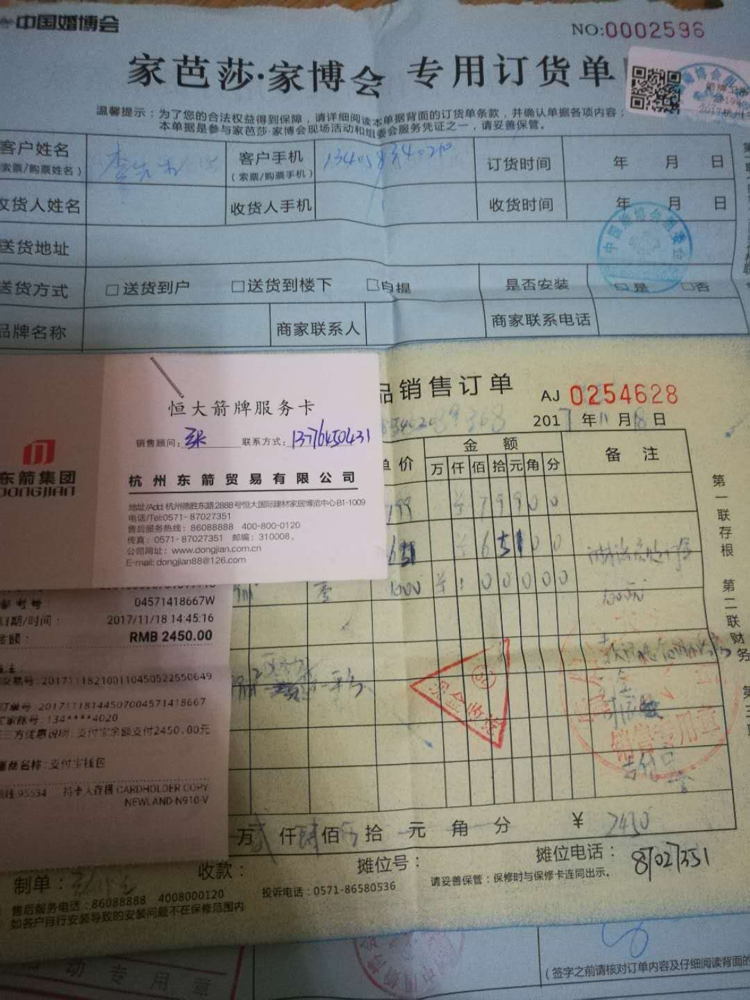
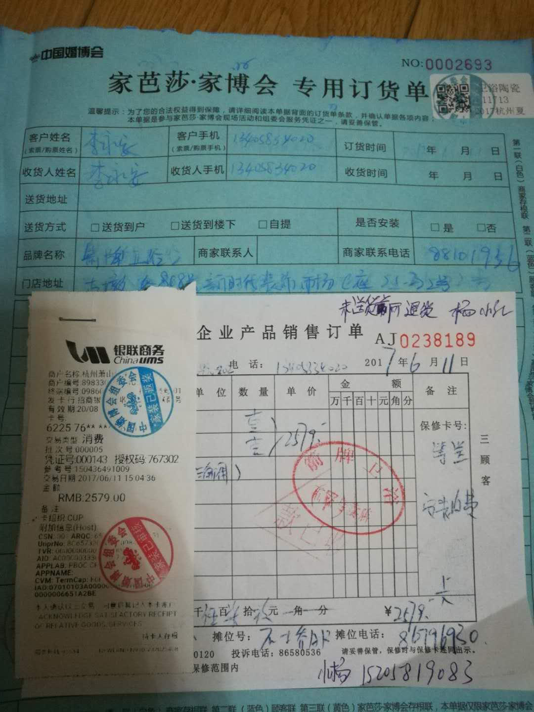
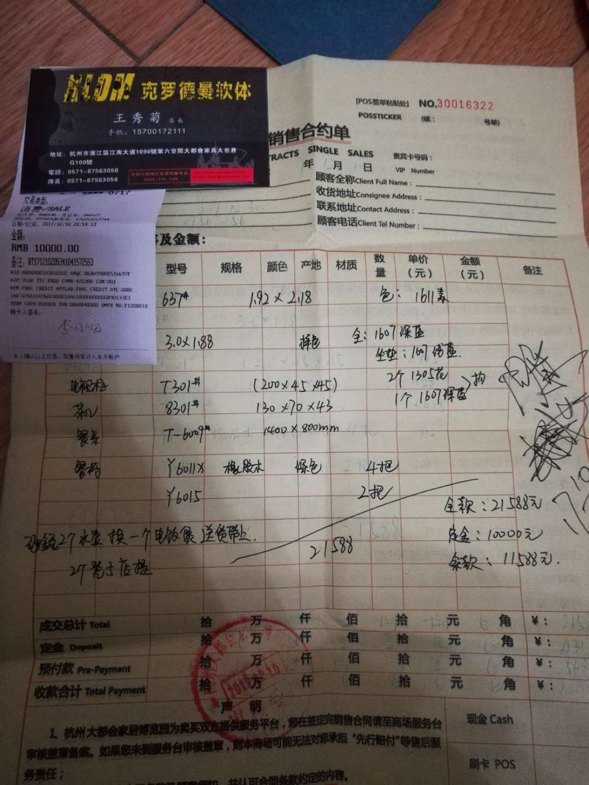

# 装修花费
| 待支付 | 条目 | 价格 |
| --- | --- | --- |
| 信用卡 | 尚品尾款 | 5137 |
| 信用卡 | 软装定金 | 10000 |
| 尾款 | 软装尾款 | 18579 |
| 信用卡 | 冰箱洗衣机 | 8500 |
|  | 总计 | 42216  |
| 银行卡余额 |  | 27638 |
| 缺口 || 14558 |

|  | 价格 | 备注 |
| --- | --- | --- |
| 软装 | 43716 |  |
| 电器 | 18920 |  |
| 卫浴 | 5030 |  |
| 木工人工费 | 6600 |  |
| 吊顶定金 | 500 |  |
| 阳台浇筑 | 3000 |  |
| 房屋设计 | 6230 |  |
| 保险箱 | 338 |  |
| 总价 | 84334 |  |

## 软装

|   | 价格 | 备注 |
| --- | --- | --- |
| 电视柜 | 2235 |  |
| 茶几 | 1960 |  |
| 沙发 | 8000 |  |
| 主卧床 | 3762 |  |
| 主卧床垫 | 3620 |  |
| 餐桌 | 2101 |  |
| 餐桌椅 | 2599 |  |
| 次卧床一套 | 4320 |  |
| 总价1 | 28579 |  |
| 尚品双柜 | 10137 |  |
| 地板定金 | 5000 | |
| 总价2 | 43716 | |

## 卫浴

|  | 价格 | 备注 |
| --- | --- | --- |
| 花洒1 | 800 |  |
| 花洒2 | 650 |  |
| 移门定金 | 1000 |  |
| 马桶 | 2580 |  |
| 总价 | 5030 |  |

## 电器

|  | 价格 | 备注 |
| --- | --- | --- |
| 油烟机三件 | 6680 |  |
| 热水器 | 3800 |  |
| 洗衣机 | 4200 |  |
| 冰箱 | 4300 |  |
| 电视 | ？  |  |
| 总价 | 18920  |  |

## 发票
淋浴房移门付1000定金，花洒800，花洒650

马桶2580

家居

